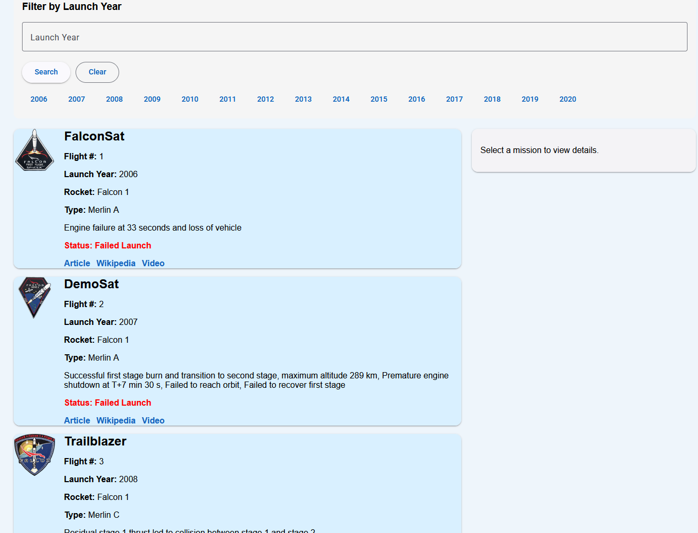
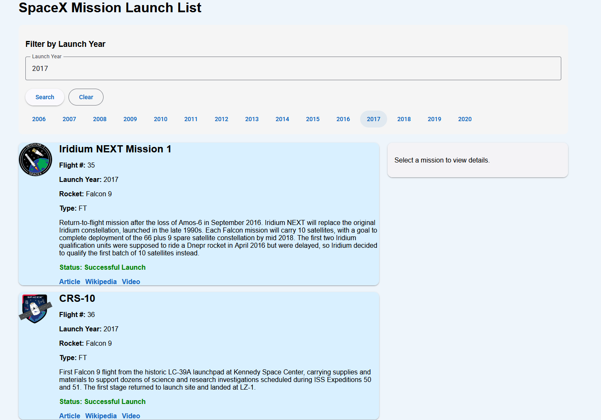
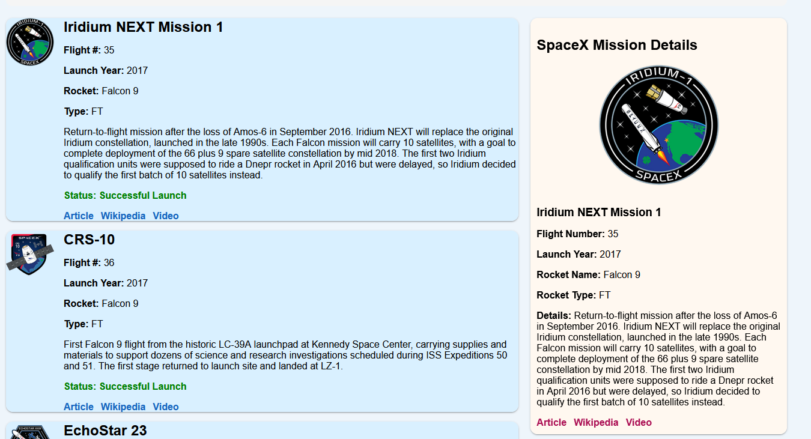

# 🚀 SpaceX Mission Angular App

## 📌 App Description

This project is an Angular application that fetches and displays SpaceX mission data using a public REST API.
It allows users to browse SpaceX launches, filter missions by launch year, and view detailed information about each mission.

The application is built using the latest Angular standalone architecture and follows best practices such as component-based design, services for API calls, and reactive forms.

---

## ✨ Features Implemented

* 📡 **API Integration**

  * Fetches SpaceX mission data using HttpClient

* 📋 **Mission List Component**

  * Displays all SpaceX launches
  * Shows:

    * Flight number
    * Mission name
    * Launch year
    * Rocket name and type
    * Mission details
    * Mission patch image

* 🔍 **Filter/Search Feature**

  * Filter missions by launch year
  * Quick-select buttons for common years
  * Reactive form implementation

* 📄 **Mission Details Component**

  * Displays detailed information of a selected mission
  * Includes:

    * Full mission details
    * Rocket info
    * External links (Article, Wikipedia, Video)

* ⚡ **Modern Angular Features**

  * Standalone components
  * Angular Signals for state management
  * Angular control flow

* 🎨 **UI Styling**

  * Angular Material components
  * Responsive layout
  * Clean and user-friendly design

---

## 🖼️ Screenshots

### 📋 Mission List View



**Description:**
Displays all SpaceX missions with key details such as mission name, launch year, rocket information, and status.

---

### 🔍 Mission Filter



**Description:**
Allows users to filter missions by launch year using input or quick-select buttons.

---

### 📄 Mission Details View



**Description:**
Shows detailed information for a selected mission, including rocket details and external resource links.

---

## 🛠️ Instructions to Run the Project

### ▶️ Run Locally

1. Clone the repository:

```bash
git clone https://github.com/btran369/101513060-lab-test2-comp3133.git
cd 101513060-lab-tets2-comp3133
```

2. Install dependencies:

```bash
npm install
```

3. Run the Angular app:

```bash
ng serve -o
```

4. Open browser:

```
http://localhost:4200
```

---

### 🌐 Run Deployed Version

Access the hosted application here:
👉 **[Live App Link](https://your-deployed-link.com)**

---

## 📦 Technologies Used

* Angular (Latest Version)
* Angular Material
* TypeScript
* RxJS
* SpaceX REST API

---

## 📁 Project Structure

```
src/app/
  missionlist/
  missionfilter/
  missiondetails/
  services/
  models/
  app.routes.ts
  app.config.ts
```

---

## 👨‍💻 Author

* Student ID: **YOUR_STUDENT_ID**
* Course: COMP 3133

---
